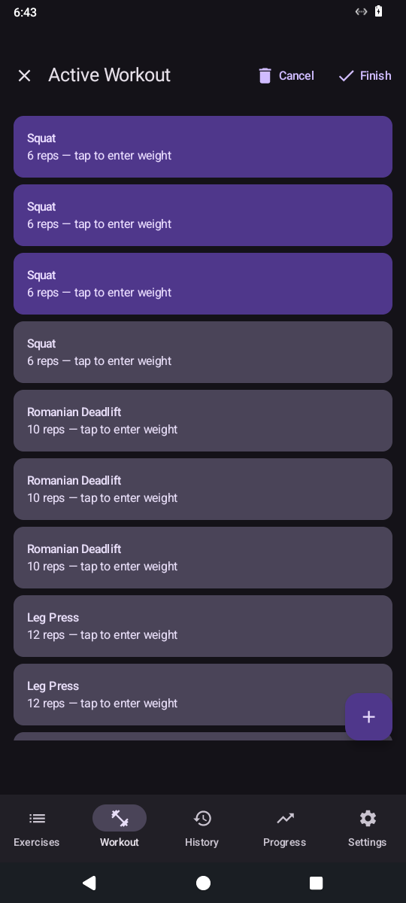
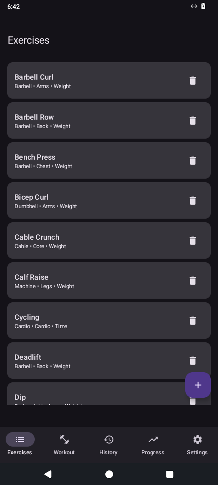

# Simple Workout Tracker

A minimal, offline-first workout tracker for Android. Built with a C++ core library and a Kotlin/Jetpack Compose UI.

<p align="center">
  
  &nbsp;&nbsp;&nbsp;&nbsp;
  
</p>

## Features

- Track sets, reps, and weight for each exercise
- Built-in exercise library with muscle group and equipment tags
- Create and reuse workout templates
- View workout history and progress over time
- Weight unit conversion (kg/lbs)
- All data stored locally in SQLite — no account required

## Architecture

The core logic lives in a shared C++ library (`lib/`) backed by SQLite. This library is used by:

- **Android app** — Kotlin + Jetpack Compose, calls the C++ lib via JNI
- **TUI** — terminal interface for desktop use

## Building the Android APK

Requirements: Android SDK, NDK, CMake.

```sh
./build-android.sh          # release build (default)
./build-android.sh debug    # debug build
```

The script downloads the SQLite amalgamation automatically on first run.

## License

MIT
